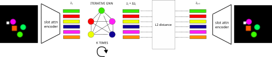

# Slot Structured World Models (SSWM)
Repository containing the code for the paper "Slot Structured World Models".


<br><br>

## Dataset
The dataset used for the experimentation in has been collected by hand (and therefore cannot be generated through a command) and is to heavy (about 8GB) to be uploaded. We will release the dataset on drive once the review process is over. 
<br>

## Pretrain Slot Attention
Use the command below to pretrain Slot Attention. Replace ```CONFIG_NAME``` with the name of the desired configuration (configs.json) to run.
```bash
python -m slot_attention.train --config CONFIG_NAME
```
### Train a world model
Use the command below to train a world model. Replace ```CONFIG_NAME``` with the name of the desired configuration (sswm_configs.json) to run.  

```bash
python -m train --config CONFIG_NAME
```
To train a SSWM it is sufficient to pass set the argument "OC_config" to the name of one Slot Attention configuration present in the file config.json (if the argument "OC_config" is None a CSWM is trained instead).
If you want to train an SSWM with Slot Attention pretrained ensure adding the key "init_ckpt" in the configuration dictionary and using as value the path to the Slot Attention weights you want to use (folder slot_attention/checkpoints/). If the argument "init_ckpt" is None, the entire model will be trained end-to-end. 

<br>

## Evaluate
Use the command below to evaluate a configuration. Replace ```CONFIG_NAME``` with the name of the desired configuration (sswm_configs.json) to run.
```bash
python -m eval --config CONFIG_NAME
```
